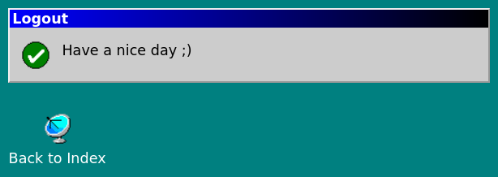

# kern.go

Web-framework for web-applications. The [biggest implementation of kern is currently written for node.js](https://github.com/GeraldWodni/kern.js).

As I needed a framework in go for developing kubernetes controllers, I decided to start this minimalistic port.


## Demo

A simple demo application can be found in the [demo-repository](https://github.com/GeraldWodni/kern.go-demo)

### tl;dr demo
```go
package main
import (
    "boolshit.net/kern"
    "boolshit.net/kern/view"
)
func main() {
    app := kern.New(":5000")
    view.Globals["AppName"] = "kern.go demo app"
    app.Router.Get("/", view.NewHandler( "index.gohtml" ) )
    app.Run()
}
```

### Fresh looks (fully responsive):




---
# Documentation
---
{{ .Emit }}
